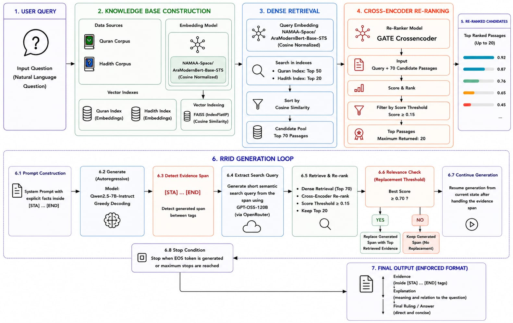

# Explainable Islamic Question Answering system

<p align="center">
  
  
  
  
  
  
  
</p>

---


## Overview

**Explainable Islamic Question Answering System** is an evidence-grounded Arabic QA framework that combines generative reasoning with retrieval-based evidence verification.

The system integrates:

* **Qwen2.5-7B-Instruct** as the reasoning and answer generation model.
* **NAMAA Retriever** for semantic retrieval over Quran and Hadith corpora.
* **GTE-TYDI-QUQA-HAQA CrossEncoder** for passage reranking.
* **GPT-OSS-120B** for semantic query extraction.
* **FAISS** for efficient dense retrieval.

Unlike traditional Retrieval-Augmented Generation (RAG), retrieval is not performed before generation. Instead, the language model first generates an answer and proposes supporting Islamic evidence inside special evidence tags:

```text
[STA] ... [END]
```

When such evidence is generated, the system intercepts the decoding process, extracts a semantic search query from the generated text, retrieves relevant Quranic verses and Hadith narrations, reranks the candidates, and replaces the generated evidence with authenticated retrieved passages whenever retrieval confidence exceeds a predefined threshold.

This Retrieval-In-Decoder (RID) strategy allows the model to preserve its reasoning capabilities while grounding religious evidence in trusted Islamic sources, resulting in more explainable and trustworthy answers.


---

## Key Features

- **Retrieval-In-Decoder Evidence Verification** -A novel decoding-time retrieval strategy is implemented to verify generated religious evidence during answer generation rather than before generation.
- **Hallucination Prevention** — Generated Islamic texts are automatically intercepted and replaced with retrieved, verified passages.
- **Dual-Corpus Retrieval** — Indexes both the Holy Quran (QPC v1.1) and Sahih Al-Bukhari Hadith separately.
- **Retrieval-Interleaved Decoding (RID)** — Real-time token-level intervention during generation.
- **Cross-Encoder Reranking** — Top retrieved passages are re-scored for relevance before injection.
- **Semantic Query Extraction** — Uses an LLM to distill a search query from raw generated text before retrieval.

---


---

## Methodology

The proposed Explainable Islamic Question Answering system follows a five-stage evidence-grounding pipeline consisting of **Fact Detection**, **Search Query Extraction**, **Dense Retrieval**, **Cross-Encoder Reranking**, and **Retrieval-In-Decoder (RID)**. These components work together to verify generated Islamic evidence and ensure that final explanations are grounded in authentic Quranic and Hadith sources.

### 1. Fact Detection

The first stage is responsible for detecting when the language model attempts to generate a religious citation or supporting evidence.

During decoding, the model is constrained to place all religious evidence inside special tags:

```text
[STA] ... [END]
```

The RID controller continuously monitors the generated output token-by-token.

When the opening tag:

```text
[STA]
```

is detected, the system enters evidence collection mode and begins storing all generated tokens.

Collection continues until:

```text
[END]
```

is generated.

The collected text is treated as the model's proposed religious evidence and becomes the input to the verification pipeline.

```text
Generated Output
       ↓
Detect [STA]
       ↓
Collect Evidence
       ↓
Detect [END]
       ↓
Evidence Candidate
```

This stage identifies factual religious claims that require verification before being included in the final answer.

---

### 2. Search Query Extraction

The generated evidence may contain unnecessary wording, incomplete references, or hallucinated content.

To improve retrieval quality, the collected evidence is converted into a concise semantic search query using **GPT-OSS-120B**.

The query extraction model receives the generated evidence and produces a short Arabic query that captures its core meaning.

Example:

Generated Evidence:

```text
بني الإسلام على خمس شهادة أن لا إله إلا الله...
```

Extracted Query:

```text
أركان الإسلام الخمسة
```

```text
Generated Evidence
        ↓
GPT-OSS-120B
        ↓
Semantic Search Query
```

This step improves retrieval effectiveness by focusing on semantic intent rather than exact lexical overlap.

---

### 3. Dense Retrieval

The extracted query is encoded using the **NAMAA Retriever**, a fine-tuned Arabic dense retrieval model.

Both Quranic verses and Hadith narrations are represented as dense embeddings and indexed using FAISS.

The system performs independent retrieval from:

* Quran Index
* Hadith Index

Retrieval configuration:

| Corpus | Top-K |
| ------ | ----- |
| Quran  | 50    |
| Hadith | 20    |

Retrieved candidates from both corpora are merged into a unified candidate pool.

```text
Semantic Query
       ↓
NAMAA Retriever
       ↓
Dense Embedding
       ↓
FAISS Search
       ↓
Top-50 Quran Passages
Top-20 Hadith Passages
       ↓
Merged Candidate Set
```

This stage maximizes recall by collecting potentially relevant evidences from both Islamic sources.

---

### 4. Cross-Encoder Reranking

Dense retrieval provides high recall but may return passages that are only partially relevant.

To improve precision, all retrieved candidates are reranked using the **GTE-TYDI-QUQA-HAQA CrossEncoder**.

For each candidate, the reranker evaluates:

```text
(Query, Passage)
```

and produces a relevance score.

Passages with scores below:

```text
0.15
```

are removed.

The remaining candidates are sorted by relevance score, and the highest-ranked passage is selected as the primary evidence candidate.

```text
Retrieved Candidates
         ↓
CrossEncoder
         ↓
Relevance Scores
         ↓
Filter Low Scores
         ↓
Top Ranked Evidence
```

This stage improves evidence quality by considering deeper semantic relationships between the query and candidate passages.

---

### 5. Retrieval-In-Decoder (RID)

The final stage performs evidence verification and replacement during generation.

The highest-ranked passage produced by the reranker is evaluated against the RID confidence threshold:

```text
threshold = 0.7
```

#### High-Confidence Retrieval

If:

```text
best_score ≥ 0.7
```

the system:

1. Removes the generated evidence.
2. Injects the retrieved authenticated passage.
3. Continues generation using the verified evidence.

#### Low-Confidence Retrieval

If:

```text
best_score < 0.7
```

the generated evidence is preserved and generation continues normally.

```text
Top Ranked Evidence
         ↓
Confidence Check
         ↓
 ┌───────────────┬───────────────┐
 │ Score ≥ 0.7   │ Score < 0.7   │
 ▼               ▼
Replace       Keep Generated
Evidence      Evidence
```

This Retrieval-In-Decoder mechanism allows the language model to retain its reasoning capabilities while ensuring that supporting Quranic verses and Hadith narrations are grounded in trusted Islamic sources.


- The combination of fact detection, semantic query extraction, dense retrieval, reranking, and Retrieval-In-Decoder verification produces explainable Islamic answers supported by authentic and relevant evidence.

---


## Architecture



---

## Models & Components

| Component | Model / Resource |
|---|---|
| **Generator** | `Qwen/Qwen2.5-7B-Instruct` |
| **Retriever** | `SeragAmin/NAMAA-retriever-cosine-final_60-90` (checkpoint-1985) |
| **Reranker** | `yoriis/GTE-tydi-quqa-haqa` (CrossEncoder) |
| **Query Extractor** | `openai/gpt-oss-120b` via OpenRouter |
| **Vector Index** | FAISS `IndexFlatIP` (cosine similarity via normalized embeddings) |

---

## Corpus

| Source | Format | Description |
|---|---|---|
| **Quran** | `.tsv` (QPC v1.1) | `QH-QA-25_Subtask2_QPC_v1.1.tsv` |
| **Hadith** | `.jsonl` | `QH-QA-25_Subtask2_Sahih-Bukhari_v1.0.jsonl` |

Hadith text is preprocessed by stripping Arabic diacritics (tashkeel) using Unicode range `\u064B–\u0652` and `\u0670`.

---

## Installation

### Requirements

```bash
pip install faiss-gpu-cu11==1.10.0
pip install --upgrade sentence_transformers
pip install transformers torch huggingface_hub python-dotenv requests
```

> For CPU-only environments, replace `faiss-gpu-cu11` with `faiss-cpu`.

### Environment Variables

Create a `.env` file in the project root:

```env
OPENROUTER_API=your_openrouter_api_key_here
Huggingface_API=your_hf_api_key
```

---

## Usage

### Basic Inference

```python
from namaa import RID, remove_sta_end_tags

question = "ما هى اركان الاسلام؟"

answer = RID(
    question,
    max_steps=512,
    threshold=0.7
)

print(remove_sta_end_tags(answer))
```

### RID Parameters

| Parameter | Type | Default | Description |
|---|---|---|---|
| `question` | `str` | — | The Arabic Islamic question |
| `max_steps` | `int` | `512` | Maximum token generation steps |
| `threshold` | `float` | `0.7` | Minimum retrieval score to replace generated text |

### Retrieval Parameters

| Parameter | Default | Description |
|---|---|---|
| `k_quran` | `50` | Number of Quran passages retrieved |
| `k_hadith` | `20` | Number of Hadith passages retrieved |
| `score_threshold` | `0.15` | Minimum reranker score to keep a passage |
| `max_returned` | `20` | Maximum passages returned after reranking |

---

## Output Format

The model follows a strict structured output format:

```
التفسير:
[STA] {Quranic verse or Hadith with source} [END]

شرح الأدلة:
{Detailed explanation of the evidence and its relevance to the question.}

الاجابة:
{The final ruling or answer.}
```

The `[STA]...[END]` tags are stripped in the final output via `remove_sta_end_tags()`.

---

## Example

**Input:**
```
ما هى اركان الاسلام؟
```

**Output (after tag removal):**
```
التفسير:
بُنِيَ الإسلامُ على خمسٍ: شهادةِ أنْ لا إلهَ إلَّا اللهُ وأنَّ محمَّداً رسولُ اللهِ، وإقامِ الصَّلاةِ، وإيتاءِ الزَّكاةِ، والحجِّ، وصومِ رمضانَ. (البخاري 8)

شرح الأدلة:

الحديث النبوي الشريف يذكر أركان الإسلام الخمسة بشكل صريح وواضح.

الاجابة:
أركان الإسلام الخمسة هي:
1. شهادة أن لا إله إلا الله وأن محمدا رسول الله.
2. إقامة الصلاة.
3. إيتاء الزكاة.
4. الحج.
5. صوم رمضان.
```


---

## Acknowledgements

- [QH-QA-25 Dataset](https://huggingface.co/) — Quran and Hadith QA corpus
- [Qwen2.5](https://huggingface.co/Qwen) — Generative language model
- [FAISS](https://github.com/facebookresearch/faiss) — Efficient similarity search
- [SentenceTransformers](https://www.sbert.net/) — Embedding and reranking framework
- [OpenRouter](https://openrouter.ai/) — LLM API gateway