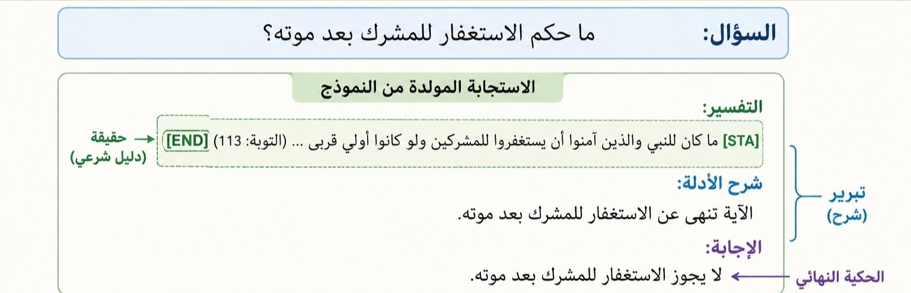
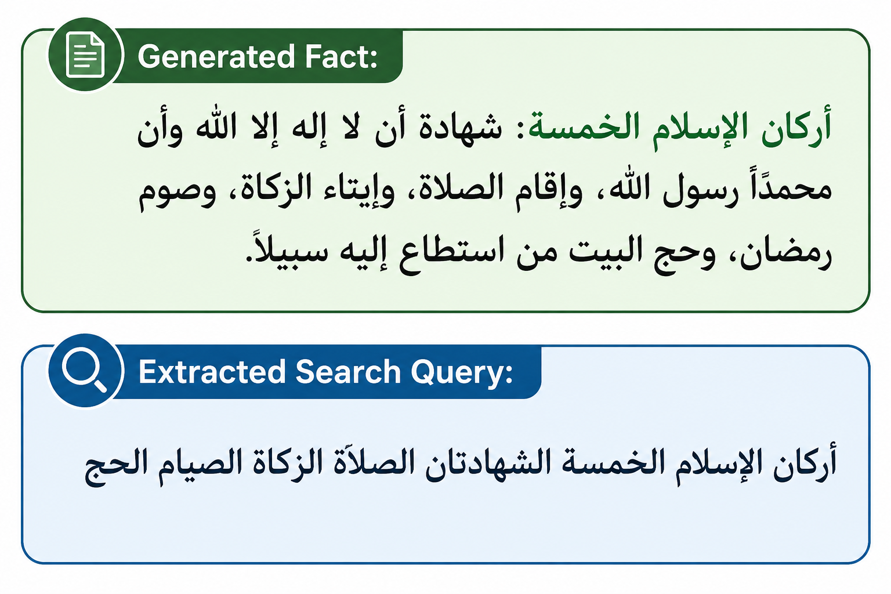

<p align="center">
  
</p>
<h1 align="center">TAHQIQ</h1>
<p align="center">
   &nbsp;Retrieval and Rerank in Decoder for Explainable and Evidence-Grounded Islamic Question Answering.
</p>


<p align="center">
  
  
  
  
  
  
</p>


---

## Overview

**TAHQIQ** is an evidence-grounded Arabic QA framework. Unlike traditional Retrieval-Augmented Generation (RAG), retrieval is not performed before generation. Instead, the language model first generates an answer and proposes supporting Islamic evidence inside special tags:

```
[STA] ... [END]
```

When such evidence is generated, the system intercepts the decoding process, extracts a semantic search query, retrieves relevant Quranic verses and Hadith narrations, reranks the candidates, and replaces the generated evidence with authenticated retrieved passages whenever retrieval confidence exceeds a predefined threshold.

This **Retrieval and Rerank In Decoder (RRID)** strategy allows the model to preserve its reasoning capabilities while grounding religious evidence in trusted Islamic sources.

---

## Key Features

| Feature | Description |
|---|---|
| 🛡️ **Hallucination prevention** | Generated Islamic texts are intercepted and replaced with retrieved, verified passages during decoding |
| 📖 **Dual-corpus retrieval** | Indexes both the Holy Quran (QPC v1.1) and Sahih Al-Bukhari Hadith in separate FAISS indexes |
| ⚙️ **Retrieval and Rerank In Decoder** | Real-time token-level intervention during generation — not before  |
| 🔽 **Cross-encoder reranking** | Top passages are re-scored for relevance before injection using a fine-tuned CrossEncoder |
| 🔍 **Semantic query extraction** | An LLM distills a concise Arabic search query from raw generated evidence text |
| 💡 **Explainable answers** | Every answer is grounded with cited Quranic verses or Hadith narrations with source references |

---

## System Architecture


---

## Five-Stage Pipeline

```
┌──────────────┐    ┌──────────────────┐    ┌──────────────────┐    ┌──────────────┐    ┌──────────────┐
│  1. Fact     │    │  2. Query        │    │  3. Dense        │    │  4. Cross-   │    │  5.RRID      │
│  Detection   │───▶│  Extraction      │───▶│  Retrieval       │───▶│  Encoder     │───▶│  Injection   │
│              │    │                  │    │                  │    │  Reranking   │    │              │
│ [STA]…[END]  │    │  GPT-OSS-120B    │    │  NAMAA + FAISS   │    │  CrossEncoder│    │ threshold 0.7│
└──────────────┘    └──────────────────┘    └──────────────────┘    └──────────────┘    └──────────────┘

```

### Stage 1 — Fact Detection

During decoding, the model places all religious evidence inside special tags. The RID controller monitors output token-by-token:

1. Detects opening `[STA]` tag → enters evidence collection mode
2. Collects all generated tokens
3. Detects closing `[END]` tag → evidence candidate is ready for verification




### Stage 2 — Semantic Search Query Extraction

The collected evidence is converted into a concise semantic search query using **GPT-OSS-120B**.

```
Generated Evidence → GPT-OSS-120B → Semantic Search Query

```



### Stage 3 — Dense Retrieval

The extracted query is encoded using the **NAMAA Retriever** and searched against two FAISS indexes:

| Corpus | Top-K |
|--------|-------|
| Quran  | 50    |
| Hadith | 20    |

Retrieved candidates from both corpora are merged into a unified candidate pool.

### Stage 4 — Cross-Encoder Reranking

All retrieved candidates are reranked using the **GTE-TYDI-QUQA-HAQA CrossEncoder**:

- Evaluates `(Query, Passage)` pairs and produces relevance scores
- Filters out passages with score below `0.15`
- Sorts remaining candidates by relevance score
- Selects the highest-ranked passage as the primary evidence candidate

### Stage 5 — Retrieval-In-Decoder (RID)

The final stage performs evidence verification and replacement during generation:

```
Top Ranked Evidence
        │
        ▼
  Confidence Check
        │
  ┌─────┴──────┐
  │            │
score ≥ 0.7  score < 0.7
  │            │
  ▼            ▼
Replace      Keep
Evidence     Generated
(verified)   Evidence
```

**High confidence (score ≥ 0.7):** Removes generated evidence and injects the retrieved authenticated passage.

**Low confidence (score < 0.7):** Preserves the generated evidence and continues generation normally.

---

## Models & Components

| Component | Model / Resource |
|---|---|
| **Generator** | `Qwen/Qwen2.5-7B-Instruct` |
| **Retriever** | `SeragAmin/NAMAA-retriever-cosine-final_60-90` (checkpoint-1985) |
| **Reranker** | `yoriis/GTE-tydi-quqa-haqa` (CrossEncoder) |
| **Query Extractor** | `openai/gpt-oss-120b` via OpenRouter |
| **Vector Index** | FAISS `IndexFlatIP` (cosine similarity via normalized embeddings) |

---

## Corpus

| Source | Format | Description |
|---|---|---|
| **Quran** | `.tsv`    | `QH-QA-25_Subtask2_QPC_v1.1.tsv` |
| **Hadith** | `.jsonl` | `QH-QA-25_Subtask2_Sahih-Bukhari_v1.0.jsonl` |

> Hadith text is preprocessed by stripping Arabic diacritics (tashkeel) using Unicode range `\u064B–\u0652` and `\u0670`.

---

## Installation

### Requirements

```bash
pip install faiss-gpu-cu11==1.10.0
pip install --upgrade sentence_transformers
pip install transformers torch huggingface_hub python-dotenv requests
```

> For CPU-only environments, replace `faiss-gpu-cu11` with `faiss-cpu`.

### Environment Variables

Create a `.env` file in the project root:

```env
OPENROUTER_API=your_openrouter_api_key_here
Huggingface_API=your_hf_api_key
```

---

## Usage

### Basic Inference

```python

question = "ما هى اركان الاسلام؟"

answer = RRID(
    question,
    max_steps=512,
    threshold=0.7
)

print(remove_sta_end_tags(answer))
```

### RRID Parameters

| Parameter | Type | Default | Description |
|---|---|---|---|
| `question` | `str` | — | The Arabic Islamic question |
| `max_steps` | `int` | `512` | Maximum token generation steps |
| `threshold` | `float` | `0.7` | Minimum retrieval score to replace generated text |

### Retrieval Parameters

| Parameter | Default | Description |
|---|---|---|
| `k_quran` | `50` | Number of Quran passages retrieved |
| `k_hadith` | `20` | Number of Hadith passages retrieved |
| `score_threshold` | `0.15` | Minimum reranker score to keep a passage |
| `max_returned` | `20` | Maximum passages returned after reranking |

---

## Output Format

The model follows a strict structured output format:

```
التفسير:
[STA] {Quranic verse or Hadith with source} [END]

شرح الأدلة:
{Detailed explanation of the evidence and its relevance to the question.}

الاجابة:
{The final ruling or answer.}
```

The `[STA]...[END]` tags are stripped in the final output via `remove_sta_end_tags()`.

---

## Example

**Input:**
```
ما هى اركان الاسلام؟
```

**Output (after tag removal):**
```
التفسير:
بُنِيَ الإسلامُ على خمسٍ: شهادةِ أنْ لا إلهَ إلَّا اللهُ وأنَّ محمَّداً رسولُ اللهِ، وإقامِ الصَّلاةِ، وإيتاءِ الزَّكاةِ، والحجِّ، وصومِ رمضانَ. (البخاري 8)

شرح الأدلة:
الحديث النبوي الشريف يذكر أركان الإسلام الخمسة بشكل صريح وواضح.

الاجابة:
أركان الإسلام الخمسة هي:
1. شهادة أن لا إله إلا الله وأن محمدا رسول الله.
2. إقامة الصلاة.
3. إيتاء الزكاة.
4. الحج.
5. صوم رمضان.
```

---

## Acknowledgements

- [QH-QA-25 Dataset](https://huggingface.co/) — Quran and Hadith QA corpus
- [Qwen2.5](https://huggingface.co/Qwen) — Generative language model
- [FAISS](https://github.com/facebookresearch/faiss) — Efficient similarity search
- [SentenceTransformers](https://www.sbert.net/) — Embedding and reranking framework
- [OpenRouter](https://openrouter.ai/) — LLM API gateway